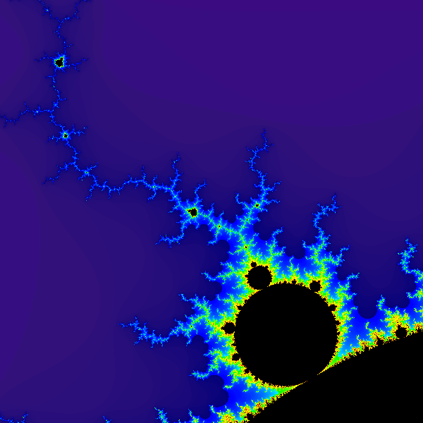

**Due: Tuesday, July 22nd by 11:59 PM**

Getting Started
===============

Download [CS201\_Assign05.zip](CS201_Assign05.zip) and import it into your Eclipse workspace (**File&rarr;Import&rarr;General&rarr;Existing projects into workspace&rarr;Archive file**.)

You should see a project called **CS201\_Assign05** in the Package Explorer. Your will be making changes to the **main** method of the **Mandelbrot** class. You should add any additional classes or methods needed to complete the program.

Your Task
=========

Your task is to implement a renderer for the [Mandelbrot Set](http://en.wikipedia.org/wiki/Mandelbrot_set), using [parallel computation](../lecture/lecture17.html) to speed up the rendering process.

The program should prompt the user for a pair of x,y coordinates specifying corners of a rectangle in the x/y plane. The program should also prompt the user to enter the name of a file ending with the ".png" file extension. Once this input has been entered, the program should render a 600 pixel by 600 pixel image which visualizes the specified region of the Mandelbrot set.

Example session (user input in **bold**):

<pre>
Please enter coordinates of region to render:
  x1: <b>-1.286667</b>
  y1: <b>-0.413333</b>
  x2: <b>-1.066667</b>
  y2: <b>-0.193333</b>
Output filename: <b>output.png</b>
Working...
Output file written successfully!
</pre>

The output file generated should be a PNG image file that looks something like this (click to see larger version):

> 

The exact appearance of the image will depend on how you choose to map the number of iterations at the sampled points to colors. See the next section for details.

The Mandelbrot Set
==================

The Mandelbrot set is a fractal: a mathematical object that is self-similar at all scales. It is defined as follows:

-   Each point on the x/y plane is interpreted as a [complex number](http://en.wikipedia.org/wiki/Complex_number), where x is the real part and y is the imaginary part.

-   A point (x,y) is considered to be in the set if, for its corresponding complex number C the equation

    > Zn+1 = (Zn)2 + C

    can be iterated any number of times without the magnitude of Z ever becoming greater than 2.0. The initial value of Z (Z0) is (0+0i).

Note that the magnitude of a complex number is the square root of the sum of the squares of its real and imaginary components. See the Wikipedia article linked above for an explanation of how to add and multiply complex numbers.

Important Hint
--------------

Because the core computation is based on complex numbers, having a class to represent complex numbers will make implementing the computation much easier. The class should look something like this:

You will need to think about what fields to add and how to implement each operation.

Once your **Complex** class is ready, you can iterate the equation as follows:


z = z.multiply(z).add(c);


This assumes that you have variables **z** and **c** that refer to instances of the **Complex** class.

Rendering the Mandelbrot Set
============================

Rendering the Mandelbrot set is done by assigning a color to sampled points in a region of the x/y plane.

Points that are in the Mandelbrot set should be rendered as black.

Points that are outside the Mandelbrot set should be rendered using a color that indicates how many times the equation was iterated before the magnitude of Z reached 2.0. In my implementation, purple is used for points where the magnitude of Z reached 2.0 in 1 iteration. Then, as higher numbers of iterations are needed for the magnitude of Z to reach 2.0, my renderer chooses colors that transition smoothly from purple, to blue, to green, to yellow, to orange, and last to red (for points that are very close to the set, but not within it.)

You may choose any assignment of colors to numbers of iterations, as long as the each color is based on the number of iterations.

So, the 600 by 600 image you render will pick sample points uniformly spaced in a 600 by 600 grid which overlays the region of the x/y plane specified by the user, and set an image color for each corresponding pixel based on whether or not the point is in the set, and if not, how many iterations were required to show that it is not in the set.

Rendering An Image, Saving It
=============================

The Java **BufferedImage** class allows you to render an image:

Once the image has been rendered into the **BufferedImage** object, you can write it to a file as follows:


OutputStream os = new BufferedOutputStream(new FileOutputStream(fileName));
try {
    ImageIO.write(bufferedImage, "PNG", os);
} finally {
    os.close();
}


Parallelism
===========

The computation performed by the program can take a fair amount of CPU time. However, the computation of the number of iterations for each point is *independent* of the computations for all other points. Therefore, you can speed the program up by using multiple threads to compute the number of iterations in different parts of the overall region.

For example, you might divide the overall region into quadrants, and use a separate thread to compute the points in each quadrant. Since there are four threads, if you run the program on a computer with 4 CPU cores, then you could see up to a 4 times speedup.

**Suggestion**: use an two-dimensional array of integer values to store the number of iterations for each of the sampled points. Each computation thread can be responsible for a subset of the elements of this array. The program should create the computation threads, start them, and then wait for them to complete (by calling the **join** method). Make sure that your program starts all of the threads before waiting for any of them to complete.

Grading Criteria
================

Your submission will be graded according to the following criteria:

-   Computation: 40%
-   Basic rendering of image: 20%

    -   Smooth interpolation of colors (extra credit): 5%

-   Use of threads for parallelism: 30%
-   Design, coding style: 10%

Submitting
==========

When you are done, submit the lab to the Marmoset server using either of the methods below.

> **Important**: after you submit, log into the submission server and verify that the correct files were uploaded. You are responsible for ensuring that you upload the correct files. I may assign a grade of 0 for an incorrectly submitted assignment.

From Eclipse
------------

If you have the [Simple Marmoset Uploader Plugin](../resources.html) installed, select the project (**CS201\_Assign05**) in the package explorer and then press the blue up arrow button in the toolbar. Enter your Marmoset username and password when prompted.

From a web browser
------------------

Save the project (**CS201\_Assign05**) to a zip file by right-clicking it and choosing

> **Export...&rarr;Archive File**

Upload the saved zip file to the Marmoset server as **assign05**. The server URL is

> <https://cs.ycp.edu/marmoset/>
